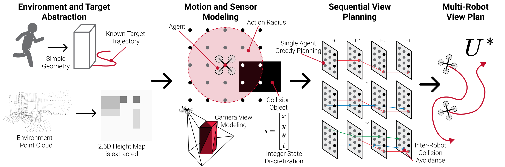
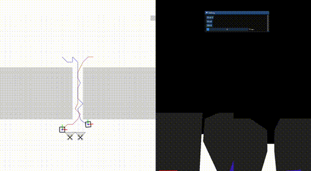
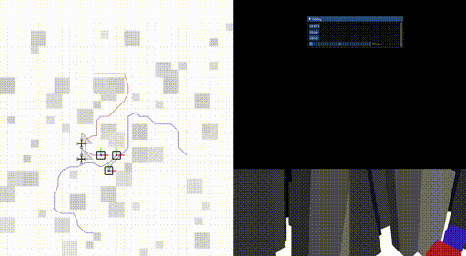
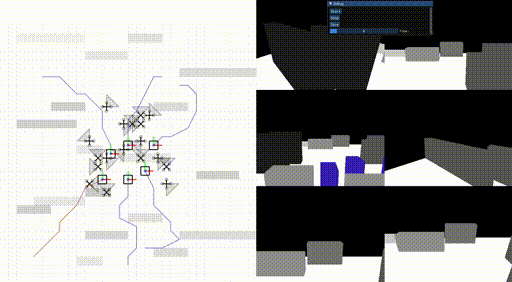
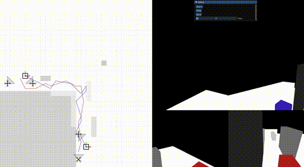
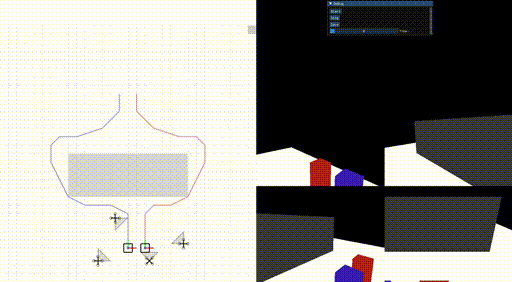

# Visual Group Coverage Planner

[Greedy Perspectives: Multi-Drone View Planning for Collaborative Perception in Cluttered Environments](https://arxiv.org/abs/2310.10863) | [Website](https://greedyperspectives.github.io/)


[Krishna Suresh](https://www.krishnasuresh.org/)<sup>1</sup>,
[Aditya Rauniyar](https://adityarauniyar.com/)<sup>2</sup>,
[Micah Corah](https://www.micahcorah.com/)<sup>3</sup>,
[Sebastian Scherer](https://www.ri.cmu.edu/ri-faculty/sebastian-scherer/)<sup>2</sup>


<sup>1</sup>Olin College,
<sup>2</sup>CMU,
<sup>3</sup>Colorado School of Mines




<!-- Brief project description and link to arxiv -->
Multi-Agent Planning algorithm that generates waypoints for Drone Fleet to maximize coverage over dynamic targets.

## Table of Contents

1. [Environment Setup](#environment-setup)
   - [Compiler Requirements](#compiler-requirements)
   - [Dependency Manager: vcpkg Setup](#dependency-manager-vcpkg-setup)
   - [External Dependencies](#external-dependencies)
   - [Included Dependencies](#included-dependencies)

2. [Build Instructions](#build-instructions)
   - [Cloning the Repository and Submodules](#cloning-this-repo-and-submodules)
   - [Building the Planner](#building-the-planner)

3. [Demo (Formation Planner)](#demo-formation-planner)

4. [Demos and Data](#demos-and-data)


## Environment Setup
This repository has been developed and tested on **Ubuntu 22.04**.

### Compiler Requirements

C++20 support is required (**this means at least g++-10**)

You can install g++-10 by running the following (on an Ubuntu system):

```bash
sudo apt install g++-10
```

You will also need to configure your system to use this compiler such as by
adding the following to your `.bashrc` file (substituting the installation path):
```bash
export CC=<path to>/gcc-10
export CXX=<path to>/g++-10
```

### Dependency Manager: vcpkg Setup
This repo uses vcpkg as a dependency manager and primary build tool. Vcpkg can be installed by following:
[https://vcpkg.io/en/getting-started.html](https://vcpkg.io/en/getting-started.html).

```bash
cd <your preferred installation directory>
git clone https://github.com/microsoft/vcpkg.git
# You may remove the flag from the following if you wish to enable telemetry
cd vcpkg && ./bootstrap-vcpkg.sh -disableMetrics

# Add the installation directory to your ~/.bashrc file
# Else export the installation directory before building:
export VCPKG_ROOT=$PWD
export PATH=$VCPKG_ROOT:$PATH
```

### External Depedencies
To build this repository all of the dependencies for [Svalorzen/AI-Toolbox](https://github.com/Svalorzen/AI-Toolbox) are required:

- [cmake](http://www.cmake.org/) >= 3.12
- the [boost library](http://www.boost.org/) >= 1.67
- the [Eigen 3.4 library](http://eigen.tuxfamily.org/index.php?title=Main_Page).
- the [lp\_solve library](http://lpsolve.sourceforge.net/5.5/) (a shared library
  must be available to compile the Python wrapper).

On a Ubuntu system, you can install these dependencies with the following
command:

```bash
sudo apt install cmake libboost-all-dev liblpsolve55-dev lp-solve libeigen3-dev pkg-config
```

### Included Depedencies

In addition, this repo provides `imgui`, `cnpy`, and `OpenGL 4`.
These will be automatically included during the build.

## Build Instructions

Clone this repo and submodules:
```
git clone --recurse-submodules git@github.com:GreedyPerspectives/GreedyPerspectives.git
```

Build planner (the first build will take longer):
```bash
cmake -B build/ -S . -DCMAKE_TOOLCHAIN_FILE="${VCPKG_ROOT}/scripts/buildsystems/vcpkg.cmake"
cd build && make -j8
```

### Demo (Formation Planner)
Run the formation planning demo (from within the build folder) to verify build:
```bash
./coverage-planner experiments/merge/form.yaml -v
```

## Demos and Data
All of the raw data for the experiments found in the paper can be found here: [IROS and ICRA data](https://drive.google.com/drive/folders/17t4n21h1UMrff4AWlkIF-tq8GW8zKNA5?usp=sharing).

The following are a few demo examples across the various test scenarios we evaluated (In all cases, the goal is to film the red and blue boxes which represent actors moving about in the scene):"

<p float="center">
  
  &nbsp; &nbsp; &nbsp; &nbsp;
  
</p>

<p float="center">
  
  &nbsp; &nbsp; &nbsp; &nbsp;
  
</p>



## BibTeX
```
@inproceedings{suresh2024greedy,
    title={Greedy Perspectives: Multi-Drone View Planning for Collaborative Perception in Cluttered Environments},
    author={Suresh, Krishna and Rauniyar, Aditya and Corah, Micah and Scherer, Sebastian},
    journal={Proc. of the {IEEE/RSJ} Intl. Conf. on Intell. Robots and Syst.},
    month=oct,
    year={2024},
}
```
